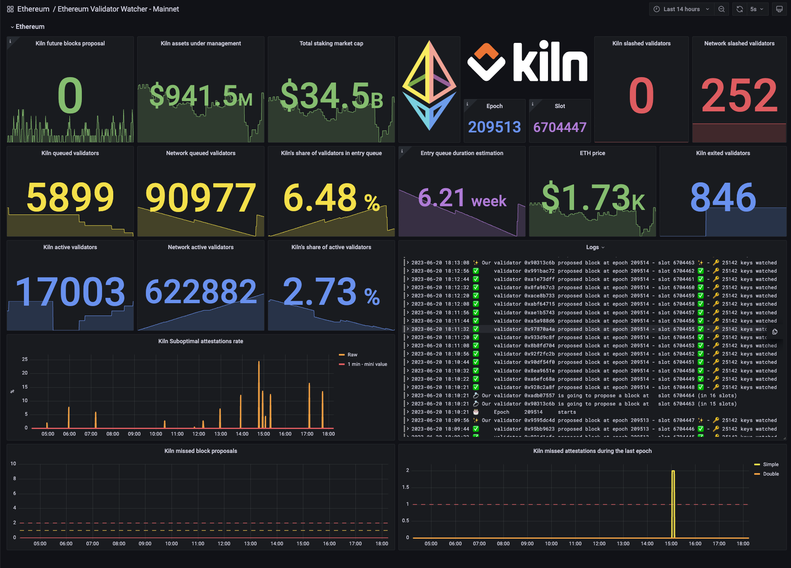

Ethereum Validator Watcher
==========================


[](https://opensource.org/licenses/MIT)

The code is provided as-is with no warranties.



Description
-----------
```
 🚨 Ethereum Validator Watcher 🚨
 This tool watches the 🥓 Ethereum Beacon chain 🥓 and tells you when some of your
 validators:
 - are going to propose a block in the next two epochs
 - missed a block proposal
 - did not attest optimally
 - missed an attestation
 - missed two attestations in a raw
 - proposed a block with the wrong fee recipient
 - exited
 - got slashed

 It also exports some general metrics like:
 - your USD assets under management
 - the total staking market cap
 - epoch and slot
 - the number or total slashed validators
 - ETH/USD conversion rate
 - the number of your queued validators
 - the number of your active validators
 - the number of your exited validators
 - the number of network queued validators
 - the number of network active validators
 - the entry queue duration estimation

 You can specify:
 - the path to a file containing the list of public your keys to watch, or / and
 - an URL to a Web3Signer instance managing your keys to watch.

 Pubkeys are load dynamically, at each epoch start.
 - If you use pubkeys file, you can change it without having to restart the watcher.
 - If you use Web3Signer, a call to Web3Signer will be done at every epoch to get the
 latest set of keys to watch.

 This program exports data on:
 - Prometheus (so you can use Grafana to monitor your validators)
 - Slack (so you can receive alerts on your phone)
 - Logs

 Prometheus server is automatically exposed on port 8000.

╭─ Options ────────────────────────────────────────────────────────────────────────────────────────────────────────────────────────────────────────────────────────────╮
│ *  --beacon-url                TEXT                             URL of beacon node [default: None] [required]                                                        │
│    --execution-url             TEXT                             URL of execution node [default: None]                                                                │
│    --pubkeys-file-path         FILE                             File containing the list of public keys to watch [default: None]                                     │
│    --web3signer-url            TEXT                             URL to web3signer managing keys to watch [default: None]                                             │
│    --fee-recipient             TEXT                             Fee recipient address - --execution-url must be set [default: None]                                  │
│    --slack-channel             TEXT                             Slack channel to send alerts - SLACK_TOKEN env var must be set [default: None]                       │
│    --beacon-type               [lighthouse|teku|other]          Use this option if connected to a lighthouse or a teku beacon node. See                              │
│                                                                 https://github.com/sigp/lighthouse/issues/4243 for Lighthouse and                                    │
│                                                                 https://github.com/ConsenSys/teku/issues/7204 for Teku.                                              │
│                                                                 [default: BeaconType.OTHER]                                                                          │
│    --liveness-file             PATH                             Liveness file [default: None]                                                                        │
│    --install-completion        [bash|zsh|fish|powershell|pwsh]  Install completion for the specified shell. [default: None]                                          │
│    --show-completion           [bash|zsh|fish|powershell|pwsh]  Show completion for the specified shell, to copy it or customize the installation. [default: None]   │
│    --help                                                       Show this message and exit.                                                                          │
╰──────────────────────────────────────────────────────────────────────────────────────────────────────────────────────────────────────────────────────────────────────╯
```

Installation
------------

From PyPI:

```
pip install eth-validator-watcher # TBD
```

From source:
```
git clone git@github.com:kilnfi/eth-validator-watcher.git
cd eth-validator-watcher
pip install .
```


Developer guide
---------------
We use [Poetry](https://python-poetry.org/) to manage dependencies and packaging.

**Installation:**
```
git clone git@github.com:kilnfi/validator-watcher.git
cd validator-watcher
poetry install --with dev
```

**Running tests:**
```
pytest

# With coverage
pytest --cov eth_validator_watcher --cov-report=term-missing
```

**Example of lineness probe usage on Kubernetes**
```yaml
livenessProbe:
  periodSeconds: 60
  initialDelaySeconds: 60
  failureThreshold: 1
  exec:
    command:
    - /usr/bin/python3.9
    - /usr/local/bin/liveness_check.py
    - /tmp/liveness
```

## License

[MIT License](LICENSE).
