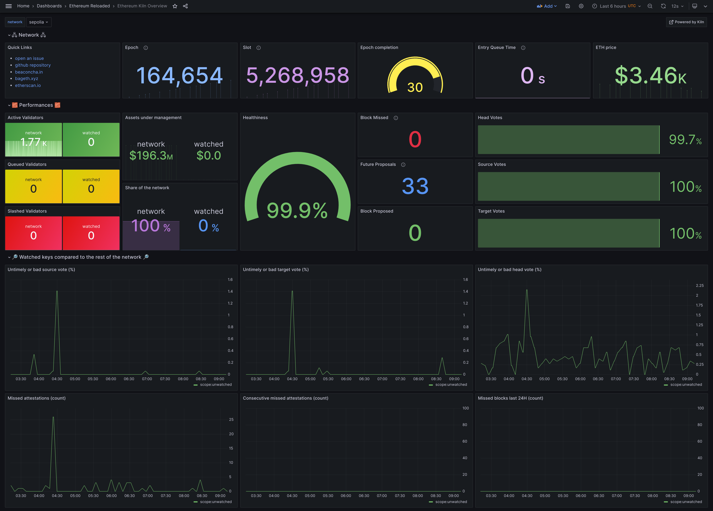
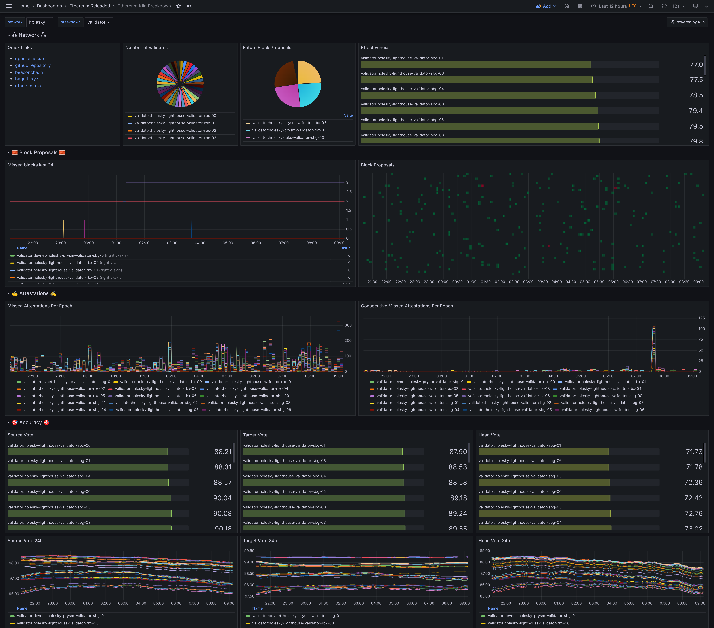

# Ethereum Validator Watcher


[](https://opensource.org/licenses/MIT)

The code is provided as-is with no warranties.

- Youtube video of [Ethereum Validator Watcher talk during EthCC[6]](https://www.youtube.com/watch?v=SkyncLrME1g&t=12s&ab_channel=%5BEthCC%5DLivestream2)
- Youtube video of [Ethereum Validator Watcher talk during EthStaker](https://www.youtube.com/watch?v=JrGz5FROgEg)

## Overview Dashboard

The [overview dashboard](grafana/dashboard-overview.json) shows an
overview of the entire set of watched keys and how they relate to the
rest of the network (asset under management, state of keys,
performances):



## Breakdown Dashboard

The [breakdown dashboard](grafana/dashboard-breakdown.json) offers a
way to compare how each set of keys in user-defined category
perform:



## Command line options

```
Usage: eth-validator-watcher [OPTIONS]

  Run the Ethereum Validator Watcher.

Options:
  --config FILE  File containing the Ethereum Validator Watcher configuration
                 file.  [default: etc/config.local.yaml]
  --help         Show this message and exit.
```

## Configuration

The configuration uses the YAML format:

```yaml
# Example config file for the Ethereum validator watcher.

beacon_url: http://localhost:5051/
beacon_timeout_sec: 90
network: mainnet
metrics_port: 8000

watched_keys:
  - public_key: '0xa1d1ad0714035353258038e964ae9675dc0252ee22cea896825c01458e1807bfad2f9969338798548d9858a571f7425c'
    labels: ["vc:validator-1", "region:sbg"]
  - public_key: '0x8619c074f403637fdc1f49b77fc295c30214ed3060573a1bfd24caea1f25f7b8e6a9076b7c721076d807003c87956dc1'
    labels: ["vc:validator-1", "region:sbg"]
  - public_key: '0x91c44564d1e61f7f6e35c330bd931590036d461378ab260b83e77f012a47605a393b5a375bf591466b274dad0b0e8a25'
    labels: ["vc:validator-2", "region:rbx"]
```

In this example, we define 3 validators which are running on two
validator clients in separate regions. The labels can be anything you
want as long as it follows the `category:value` format. The
[breakdown dashboard](docs/img/watcher-breakdown.png) uses it to offer
per-value comparisons within a category. You can for instance compare your
missed attestations between region `rbx` and `sbg`, or between `validator-1`
and `validator-2`. This comes handy when operating at scale, you can
quickly isolate where an issue comes from if your groups match your
infrastructure.

Any categories of labels is possible, some plausible examples:

- by beacon instance (i.e: beacon:beacon-1)
- by client version (i.e: prysm:v5.0.3)
- by cluster (i.e: cluster:baremetal-1)
- by operator (i.e: operator:kiln)

By default, the watcher exports the following labels:

- `scope:watched` for the keys present in the configuration file,
- `scope:network` for the entire network without the keys in the configuration file,
- `scope:all-network` for the entire network including the watched keys.

Those are used by the overview dashboard and the breakdown dashboard
to offer a comparison of your validator keys with the network.

The configuration can be updated in real-time, the watcher will reload
it dynamically on the next epoch. This allows to have growing sets of
validators, for instance if you deploy new keys.

## Beacon Compatibility

Beacon type      | Compatibility
-----------------|------------------
Lighthouse       | Full.
Prysm            | Full.
Teku             | Not (yet) tested.
Nimbus           | Not (yet) tested.
Lodestar         | Not (yet) tested.

The beacon type is relative to the beacon node connected to the
watcher, **not to the beacon node connected to the validator client
containing a validator key you want to watch**. The watcher is
agnostic of the infrastructure mananing validators keys you want to
watch, this means you can run it on an external location if you want
blackbox monitoring.

## Installation

From source:

```
git clone git@github.com:kilnfi/eth-validator-watcher.git
cd eth-validator-watcher
pip install .
```

Or with uv:

```
git clone git@github.com:kilnfi/eth-validator-watcher.git
cd eth-validator-watcher
uv venv
source .venv/bin/activate
uv pip install .
```

We recommend using the Docker images.

## Docker images

Docker images (built for AMD64 and ARM64) are available
[here](https://github.com/kilnfi/eth-validator-watcher/pkgs/container/eth-validator-watcher).

## Developer guide

We use [uv](https://github.com/astral-sh/uv) to manage dependencies and packaging.

**Installation:**

```
git clone git@github.com:kilnfi/validator-watcher.git
cd validator-watcher
uv venv
source .venv/bin/activate
uv pip install -e ".[dev]"
```

**Running tests:**

```
source .venv/bin/activate
just test
```

**Running linter:**

```
source .venv/bin/activate
just lint
```

## License

[MIT License](LICENSE).