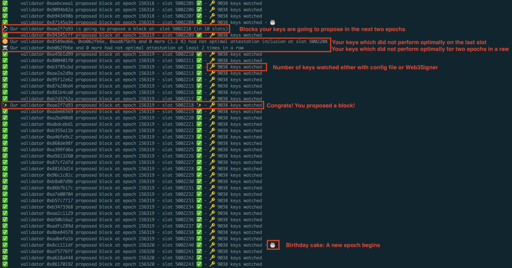
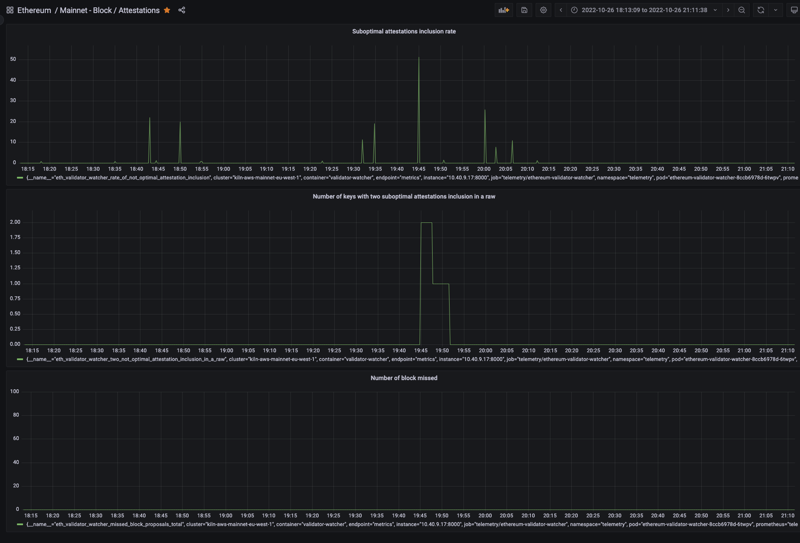

Ethereum Validator Watcher
==========================


[](https://opensource.org/licenses/Apache-2.0)

The code is provided as-is with no warranties.

Description
-----------

```
Usage: eth-validator-watcher [OPTIONS]

  🚨 Be alerted when you miss a block proposal / when your attestations are
  late! 🚨

  This tool watches the 🥓 Ethereum Beacon chain 🥓 and tells you:
  - when you miss a block proposal
  - when some of your attestations are not optimally included in the next slot
  - when some of your attestations are not optimally included in the next slot two
    times in a raw (may indicates there is an issue with this specific key)
  - if one of your keys are about to propose a block in the next two epochs (useful
    when you want to reboot one of your validator client without pressure)

  You can specify:
  - the path to a file containing the list of public your keys to watch, or / and
  - an URL to a Web3Signer instance managing your keys to watch.

  Pubkeys are load dynamically, at each slot.
  - If you use pubkeys file, you can change it without having to restart the watcher.
  - If you use Web3Signer, a call to Web3Signer will be done at every slot to get the
  latest keys to watch.

  Three prometheus probes are exposed:
  - A missed block proposals counter of your keys
  - The rate of non optimal attestation inclusion of your keys for a given slot
  - The number of two non optimal attestation inclusion in a raw of your keys

  Prometheus server is automatically exposed on port 8000.

Options:
  --beacon-url TEXT               URL of Teku beacon node  [required]
  --pubkeys-file-path FILE        File containing the list of public keys to
                                  watch
  --web3signer-url TEXT           URL to web3signer managing keys to watch
  --liveliness-file PATH          Liveness file
  --prometheus-probe-missed-block-proposals TEXT
                                  Prometheus probe name for missed block
                                  proposals  [default: eth_validator_watcher_m
                                  issed_block_proposals]
  --prometheus-probe-rate-of-not-optimal-attestation-inclusion TEXT
                                  Prometheus probe name for rate of non
                                  optimal attestation inclusion  [default: eth
                                  _validator_watcher_rate_of_not_optimal_attes
                                  tation_inclusion]
  --prometheus-probe-number-of-two-not-optimal-attestation-inclusion-in-a-raw TEXT
                                  Prometheus probe name for number of two non
                                  optimal attestation  inclusion in a raw
                                  [default: eth_validator_watcher_two_not_opti
                                  mal_attestation_inclusion_in_a_raw]
  --install-completion [bash|zsh|fish|powershell|pwsh]
                                  Install completion for the specified shell.
  --show-completion [bash|zsh|fish|powershell|pwsh]
                                  Show completion for the specified shell, to
                                  copy it or customize the installation.
  --help                          Show this message and exit.
```

Logs sample
-----------


Prometheus sample
-----------------


Installation
------------

To install it from PyPI:

```console
pip install eth-validator-watcher
```

To install it from source:
```console
git clone git@github.com:kilnfi/eth-validator-watcher.git
cd eth-validator-watcher
pip install .
```


Developer guide
---------------

**Installation:**
```console
git clone git@github.com:kilnfi/validator-watcher.git
cd validator-watcher
pip install -e .[dev]
```

**Running tests:**
```console
pytest
```

**Example of lineness probe usage on Kubernetes**
```yaml
livenessProbe:
  periodSeconds: 60
  initialDelaySeconds: 60
  failureThreshold: 1
  exec:
    command: 
    - /bin/bash
    - -c
    - '[[ $(date -d "last minute" +%s) < $(date -r /tmp/liveliness +%s) ]] && exit 0 || exit 1'
```

## License

[Apache 2.0 License](LICENSE).
